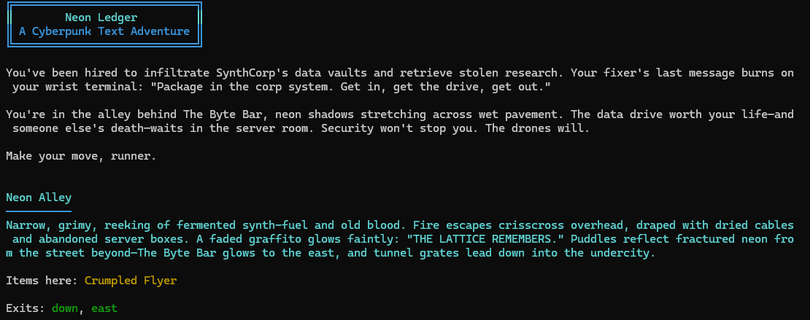

# Neon Ledger

```
███╗   ██╗███████╗ ██████╗ ███╗   ██╗    ██╗     ███████╗██████╗  ██████╗ ███████╗██████╗ 
████╗  ██║██╔════╝██╔═══██╗████╗  ██║    ██║     ██╔════╝██╔══██╗██╔════╝ ██╔════╝██╔══██╗
██╔██╗ ██║█████╗  ██║   ██║██╔██╗ ██║    ██║     █████╗  ██║  ██║██║  ███╗█████╗  ██████╔╝
██║╚██╗██║██╔══╝  ██║   ██║██║╚██╗██║    ██║     ██╔══╝  ██║  ██║██║   ██║██╔══╝  ██╔══██╗
██║ ╚████║███████╗╚██████╔╝██║ ╚████║    ███████╗███████╗██████╔╝╚██████╔╝███████╗██║  ██║
╚═╝  ╚═══╝╚══════╝ ╚═════╝ ╚═╝  ╚═══╝    ╚══════╝╚══════╝╚═════╝  ╚═════╝ ╚══════╝╚═╝  ╚═╝
```

<p align="center">
  
</p>

> *Data runs through the streets. You run the streets.*

**Neon Ledger** is a cyberpunk **text adventure** set in a rain-soaked megacity where corporations control the districts and information is the most valuable currency.

Navigate neon alleys, talk to underground contacts, avoid surveillance drones, and uncover the truth behind a missing fixer before the clock runs out.

This project is also an **AI development experiment** exploring how far agent-based tooling can go in generating a complete software project.

---

# 🧪 AI Experiment

Neon Ledger was created as an experiment using the agent framework:

[https://github.com/bradygaster/squad](https://github.com/bradygaster/squad)

The goal of the project was to explore **AI-driven software development** using orchestrated agents to generate:

* Game concept
* World design
* Story and narrative
* Command system
* Game engine logic
* Test suite
* Documentation

The result is a **fully playable .NET text adventure generated entirely by AI agents**.

This repository exists primarily as a **proof of concept** demonstrating what agent-based development workflows can produce.

---

# 🎮 Gameplay

Your fixer has disappeared.

The last message they sent contained fragments of a data route buried somewhere in **SynthCorp’s network infrastructure**.

You have limited time before the trail goes cold.

Explore the districts.
Talk to contacts.
Avoid the drones.
Find the chip.

And get out alive.

---

# 🚀 Quick Start

## Requirements

* **.NET 10 SDK**

## Run the game

```bash
cd src/MyGame
dotnet run
```

The game will start immediately in your terminal.

---

# 🎮 Commands

| Command           | Aliases                                                            | Description                    |
| ----------------- | ------------------------------------------------------------------ | ------------------------------ |
| `go <direction>`  | `north`, `south`, `east`, `west`, `n`, `s`, `e`, `w`, `up`, `down` | Move in a direction            |
| `look`            | `l`                                                                | Describe your current location |
| `look <item>`     | —                                                                  | Examine an item in the room    |
| `take <item>`     | `get`, `grab`, `pick`                                              | Pick up an item                |
| `drop <item>`     | —                                                                  | Drop an item                   |
| `examine <item>`  | `x`, `inspect`, `read`                                             | Inspect an item closely        |
| `use <item>`      | —                                                                  | Use an item                    |
| `talk <npc>`      | `speak`                                                            | Talk to a character            |
| `inventory`       | `inv`, `i`                                                         | Show inventory                 |
| `help`            | `?`, `commands`                                                    | Show commands                  |
| `save [filename]` | —                                                                  | Save game                      |
| `load [filename]` | —                                                                  | Load game                      |
| `quit`            | `exit`, `q`                                                        | Exit the game                  |

---

# 💾 Saving & Loading

Save your progress at any time.

```bash
save
save mysave
load mysave
```

Game state is stored as **JSON**.

---

# 🧠 Tips

* **Examine everything** — clues often hide in item descriptions.
* **Talk to NPCs** — information is currency.
* **Move quickly** — the city is watching.
* **Keep track of exits** — the city isn’t forgiving.

---

# 🏗 Development

## Run Tests

```bash
cd src/MyGame.Tests
dotnet test
```

## Technology Stack

* **C#**
* **.NET 10**
* **xUnit**
* **Newtonsoft.Json**

---

# ⚙️ Engine Features

The game engine includes:

* **World Loader**
  Loads rooms, items, NPCs, and exits from JSON.

* **Command Parser**
  Handles navigation and interaction commands.

* **Narrator Engine**
  Descriptions change based on player state and inventory.

* **Save / Load System**
  Game state serialized to JSON.

* **Colored Terminal Output**
  ANSI styling for improved immersion.

---

# 📂 Project Structure

```
src/
 ├─ MyGame/
 │   ├─ Engine
 │   ├─ Commands
 │   ├─ World
 │   └─ Program.cs
 │
 └─ MyGame.Tests/
     └─ Engine tests
```

---

# 🎯 Project Goals

This project explores:

* AI-generated game design
* Agent-driven software development
* Automated code generation workflows
* Structured prompt engineering for software projects

---

# ⚠️ Disclaimer

This project was generated as an **AI experiment** and is not intended as a production game.

The repository exists primarily to demonstrate the potential of **AI agent orchestration frameworks** such as **Squad**.

---

# 📜 License

MIT License
